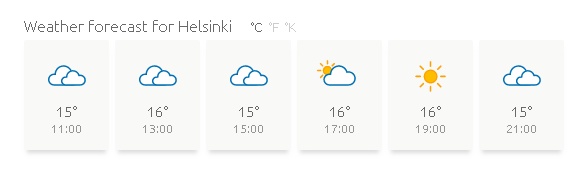

# Beginner weather app in React
A small app/widget that displays a weather forecast spanning the next couple of hours. The app is essentially a partial view to the [open data API of the Finnish Meteorological Institute](https://en.ilmatieteenlaitos.fi/open-data-manual), from which it fetches the weather forecast data for display.

This was my first time using React, and, specifically, vanilla React. That is, React without tools like Babel, Webpack, etc. - although JSX/Babel was added in a later commit.

## Usage

### Building
The app depends on Babel for JSX and minification. You can install the required dependencies by executing the following in the repo's root:
```
$ npm install @babel/core @babel/cli @babel/preset-react babel-preset-minify
```

Once you have Babel installed as per above, you can build the app by running [build.sh](build.sh) (or by directly executing `./node_modules/.bin/babel js/ --out-dir dist/`).

Note that the [dist/](dist/) directory comes pre-populated with the app's latest build, so if you've just downloaded the repo to run the app, you don't have to commence with the build step, but can instead proceed to the [End-user](#end-user) section.

### End-user
The app can be executed by opening [index.html](index.html) in a browser.

However, depending on your browser, you may need to access `index.html` via a server. To do that, you could, for instance, use PHP's built-in server, by executing the following in the repo's root:
```
$ php -S localhost:8000
```

Browsing to `localhost:8000` should then display the weather forecast for Helsinki:

 

To change the place for which the forecast is given, add the `place` address parameter. For instance, the following will display the forecast for Tampere:
```
localhost:8000/?place=Tampere
```

### Developer
The app's JavaScript entry point can be found in [index.html](index.html), where an instance of the weather app is initialized.

*(More on this topic, later.*)